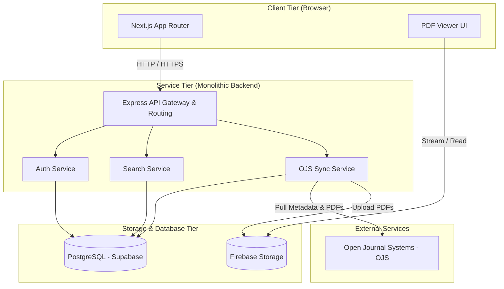

# Architecture

This document describes the system architecture for the ScienceDirect-inspired MVP research publishing and discovery platform.

## Architecture Overview

## Core Principles

- **Monolithic Backend:** Express.js + TypeScript, simple to scale vertically and deploy.
- **Separate Frontend & Backend:** Next.js App Router for frontend UI, communicating with the monolithic Express backend via API.
- **Repository + Service Pattern:** Clean separation of concerns with Controllers, Services, and Repositories.
- **OJS as Authority:** OJS remains the source of truth for editorial workflows. The platform pulls published content and acts as a read-heavy discovery layer.

## System Boundaries and Interfaces

### 1. Monolithic Backend (Express.js)
The backend is organized using a feature-based structure (`src/features/...`).
- **Auth Service:** Issues and validates JWT access and refresh tokens. Authenticated sessions are stored in HTTP-only cookies.
- **OJS Sync Service:** Scheduled cron processes pull new publications from OJS REST APIs, downloading PDFs and storing them in Firebase Storage, then caching metadata in PostgreSQL.
- **Search Service:** Implements PostgreSQL Full-Text Search (FTS) using weighted fields (title, abstract, keywords) and a GIN index.

### 2. Frontend Application (Next.js)
- **Server-Side Rendering (SSR):** Renders articles, search pages, and journal homepages for SEO optimization.
- **Client Components:** Renders dashboards, interactive search controls, and reading history options.
- **Authentication:** Sessions are propagated via cookie headers forwarded from Next.js server actions / SSR fetches to the Express backend.

### 3. Database (Supabase PostgreSQL)
- **Source of Truth:** PostgreSQL holds all indexed articles, journals, issues, users, bookmarks, and sync logs.
- **Soft Deletes:** Standard `deleted_at` timestamps on all tables.
- **UUID Keys:** Standard UUIDs (`gen_random_uuid()`) for primary keys.

### 4. Storage (Firebase Storage)
- PDF galleys downloaded from OJS are stored in Firebase Storage.
- Signed URLs or public read-only paths are supplied to the frontend PDF reader.